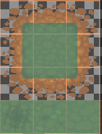
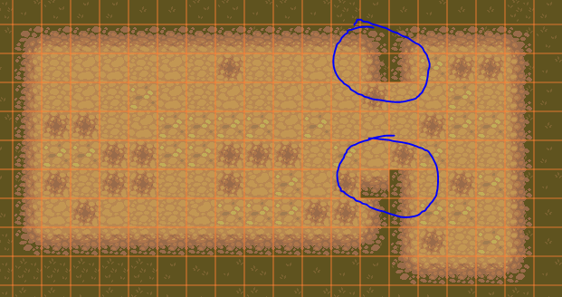
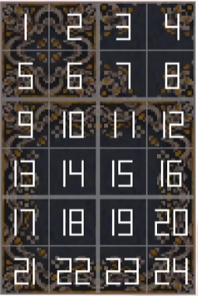
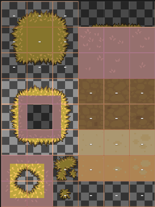
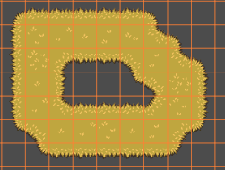
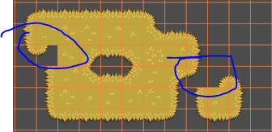
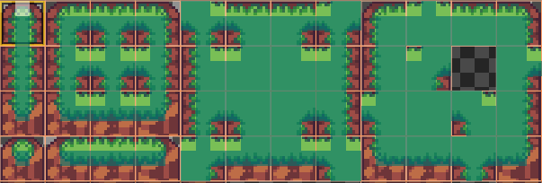
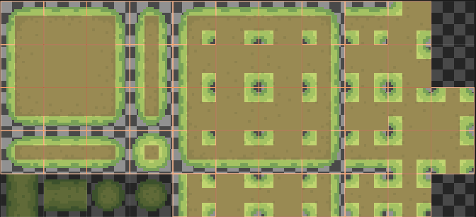

# 首先是最简单的一种:

下面3个tile 和中间的tile 是重复随机替换磁块.由于过于简单,不支持过渡,比如转角.

# 第二种:

这个素材来自于RPGMaker,相较于第一种,多了块右上角(3,4,7,8),用来弥补不支持转角的不足  
(1,2,4,6 重复与9,12,21,24 用于RPGMaker 磁贴缩略图)  

下面实例素材来自与 LPC style.   
中间9块(粉红)是主体边缘,中间则是由  
右上角6块(粉红)重复随机替换磁块  
下面4块(粉红)则是内转角  

使用效果:  

这种磁贴,由于缺少某些衔接,所以某些拐点仍然有缺陷:  

# 下面是最复杂的一种,也支持最全的(47-tile Autotile Full Bitmask):

支持过渡

下面是一种变体, 和上面类似(47-tile Autotile Full Bitmask):

TODO 收集更多组合

Godot Docs:
https://github.com/dandeliondino/godot-4-tileset-terrains-docs  

Assemble 3x3 bitmask to 47 tile Format  
https://github.com/HeartoLazor/autotile_generator  
https://github.com/pyrareae/GodotAutotileAssembler  

Bitmask Autotile Generator for Godot & Unity(Turn a single tile into a seamless 47-tile Autotile bitmask set with a live testing canvas.)  
https://jaconir.online/blogs/bitmask-autotile-guide  
https://jaconir.online/tools/bitmask-autotile-generator  

15-Tile Format(Wang) to 47 tile Format(Blob)  
https://github.com/itsjavi/autotiler  
https://route1rodent.itch.io/autotiler  

Web Autotyler is an autotile conversion tool for turning small/incomplete autotile tilesets into complete, fleshed-out ones.
It supports nine different input formats and three different output formats, and displays a preview.  
https://github.com/wareya/webtyler?tab=readme-ov-file  
https://wareya.github.io/webtyler/  